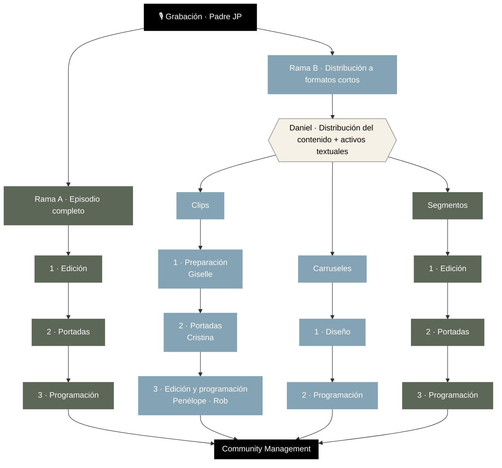

# Equipo de Contenido · Padre JP García

Flujo de trabajo del equipo de contenido: **pasos, dependencias y encargados** desde la grabación hasta la publicación y la conversación con la comunidad.

📊 **Presentación visual:** https://ramotasaray.github.io/equipo-padre-jp/

---

## Cómo leer este documento

- **Formatos largos** (Episodio, Segmento) → color oliva en el deck.
- **Formatos cortos** (Clip, Carrusel) → color azul en el deck.
- Cada pieza nace de **una sola grabación**. De ahí se ramifica a dos vías que avanzan **en paralelo**.
- Dentro de cada rama, los pasos son **secuenciales**: un paso no empieza hasta que el anterior termina.

---

## Diagrama del flujo

> Si el diagrama no se ve, abrilo en GitHub (renderiza Mermaid automáticamente) o consultá el desglose de abajo.

---

## Nodo raíz

**🎙 Grabación · Padre JP**
Todo el contenido de la semana proviene de esta única grabación. Es la dependencia común: ninguna rama puede arrancar antes de que la grabación exista.

---

## Rama A · Episodio completo

Formato largo. **Encargadas: Iraís · Mariam** (las mismas en los tres pasos).

| # | Paso | Encargadas | Depende de |
|---|------|-----------|------------|
| 1 | Edición | Iraís · Mariam | Grabación |
| 2 | Portadas | Iraís · Mariam | Paso 1 |
| 3 | Programación | Iraís · Mariam | Paso 2 |

→ Publica en **Spotify** y **YouTube**.

---

## Rama B · Distribución a formatos cortos

**Lidera: Daniel** — distribución del contenido y preparación de activos textuales. Daniel toma la grabación y la reparte hacia las tres sub-ramas, que luego avanzan **en paralelo** entre sí.

### Clips
Formato corto. Los encargados **varían en cada paso**.

| # | Paso | Encargado | Depende de |
|---|------|-----------|------------|
| 1 | Preparación | Giselle | Distribución (Daniel) |
| 2 | Portadas | Cristina | Paso 1 |
| 3 | Edición y programación | Penélope · Rob | Paso 2 |

→ Es el formato más distribuido: **Instagram, Facebook, TikTok, YouTube, Spotify**.

### Carruseles
Formato corto. **Encargada: Celeste** (los dos pasos).

| # | Paso | Encargada | Depende de |
|---|------|-----------|------------|
| 1 | Diseño | Celeste | Distribución (Daniel) |
| 2 | Programación | Celeste | Paso 1 |

→ Publica en **Instagram**.

### Segmentos
Formato largo (duración media). **Encargada: Mimí** (los tres pasos).

| # | Paso | Encargada | Depende de |
|---|------|-----------|------------|
| 1 | Edición | Mimí | Distribución (Daniel) |
| 2 | Portadas | Mimí | Paso 1 |
| 3 | Programación | Mimí | Paso 2 |

→ Publica en **YouTube**.

---

## Community Management · capa transversal

No es un paso secuencial: se activa **una vez publicado** el contenido y envuelve todas las plataformas. La conversación con la comunidad queda cubierta sin importar el formato.

| Frente | Encargado |
|--------|-----------|
| Instagram | Padre JP |
| Resto de plataformas | Melissa |

---

## Resumen de dependencias

1. **Grabación → todo.** Nada arranca sin la grabación del Padre JP.
2. **Rama A ∥ Rama B.** El episodio completo y la distribución a formatos cortos avanzan en paralelo.
3. **Daniel reparte la Rama B.** Las tres sub-ramas dependen de que Daniel distribuya el contenido y prepare los activos textuales.
4. **Clips ∥ Carruseles ∥ Segmentos.** Una vez repartidas, las tres sub-ramas son independientes entre sí.
5. **Pasos internos = secuenciales.** Dentro de cada formato, cada paso espera al anterior.
6. **Community Management = post-publicación.** Cubre la conversación una vez que el contenido está en línea.

---

## Encargados de un vistazo

| Persona | Responsabilidad |
|---------|-----------------|
| **Padre JP** | Grabación · Community Management (Instagram) |
| **Daniel** | Liderazgo de distribución · activos textuales |
| **Iraís · Mariam** | Episodio completo (edición, portadas, programación) |
| **Giselle** | Clips · Preparación |
| **Cristina** | Clips · Portadas |
| **Penélope · Rob** | Clips · Edición y programación |
| **Celeste** | Carruseles (diseño, programación) |
| **Mimí** | Segmentos (edición, portadas, programación) |
| **Melissa** | Community Management (resto de plataformas) |
